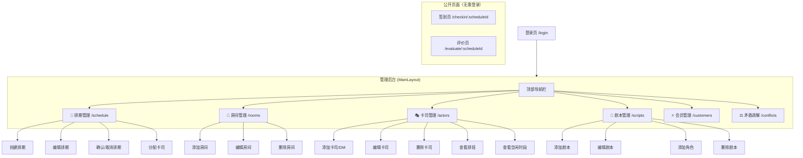
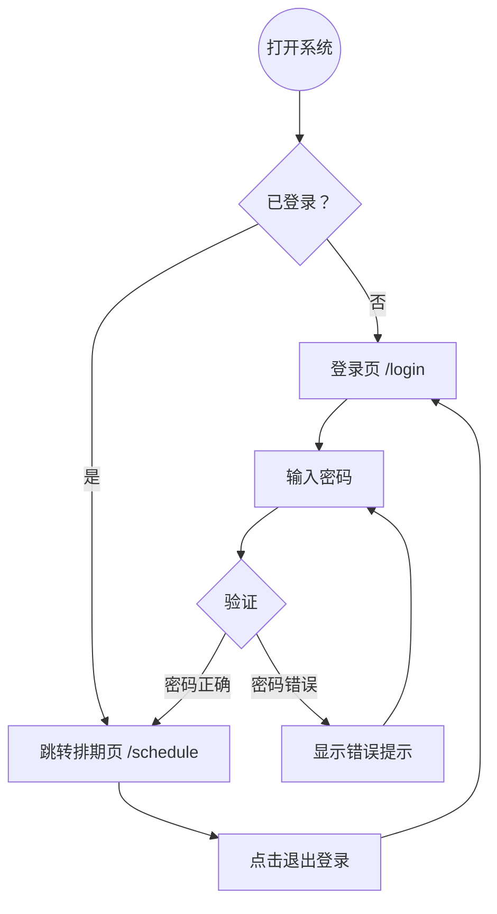
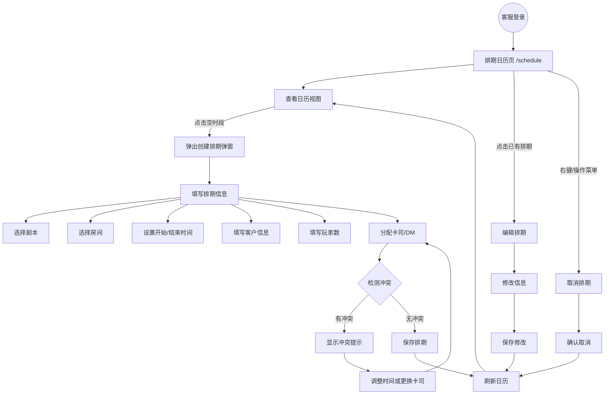
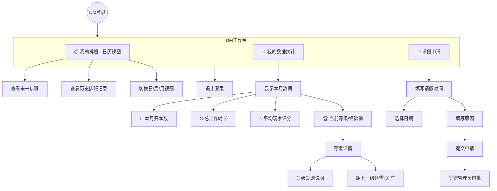
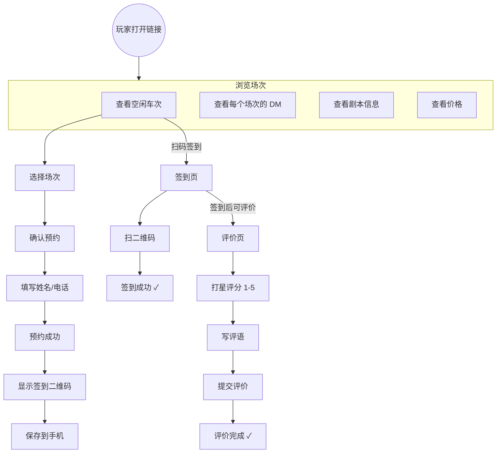
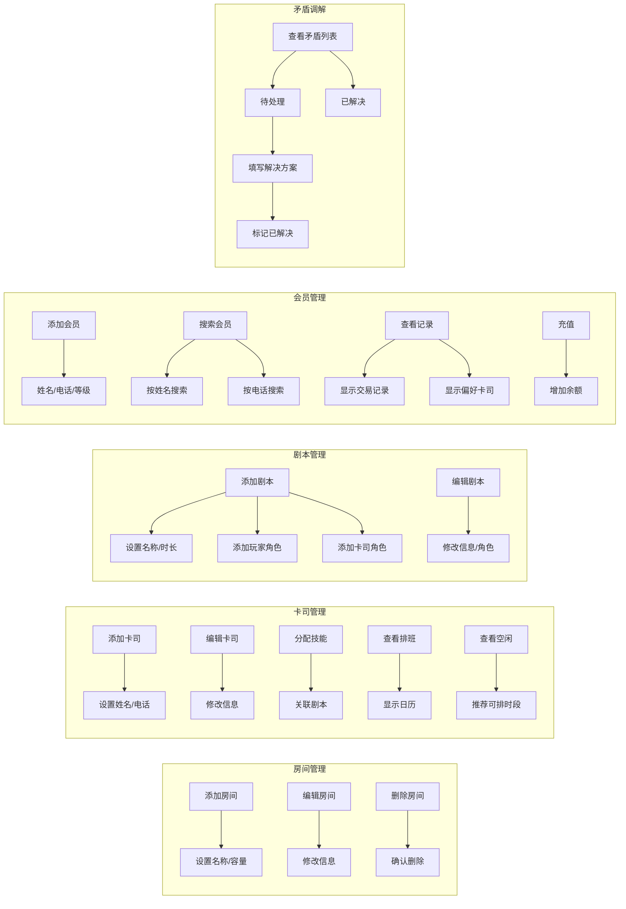

# 剧本杀排期管理系统 — 用户流程图

> 本文档使用 Mermaid 图表，GitHub 会自动渲染。
> 每个图表展示一个角色在使用系统时的页面流转路径。

---

## 一、系统整体信息架构



---

## 二、登录流程



---

## 三、客服排班流程（核心）

这是系统的核心功能——客服创建和管理排班。



---

## 四、DM（主持人）使用流程



---

## 五、玩家使用流程



---

## 六、管理端工作流程



---

## 七、页面路由总览

```
公开页面（无需登录）
├── /login                          — 登录页
├── /checkin/:scheduleId            — 玩家签到页
└── /evaluate/:scheduleId           — 玩家评价页

管理后台（需登录，MainLayout 包裹）
├── /schedule                       — 📅 排期管理（首页）
├── /rooms                          — 🚪 房间管理
├── /actors                         — 🎭 卡司管理
├── /scripts                        — 📖 剧本管理
├── /customers                      — ⭐ 会员管理
└── /conflicts                      — ⚖️ 矛盾调解
```

---

## 八、下次迭代建议（按流程图撸代码）

根据上面的流程图，下一轮开发按这个顺序做最合理：

**第一轮** → 先把 Phase 1 收尾
1. 修复剧本创建（列名不匹配，参考房间 bug 的修法）
2. 把 evaluations 从本地 SQLite 切到 Supabase

**第二轮** → DM 模块（竞争壁垒）
3. DM 工作台页面（只看自己的排班）
4. DM 统计：本月开本数、评分
5. DM 等级体系

**第三轮** → 玩家端
6. 玩家浏览场次页面
7. 玩家预约
8. 扫码签到优化

---

> 文档版本：v0.1 | 最后更新：2026-05-04
