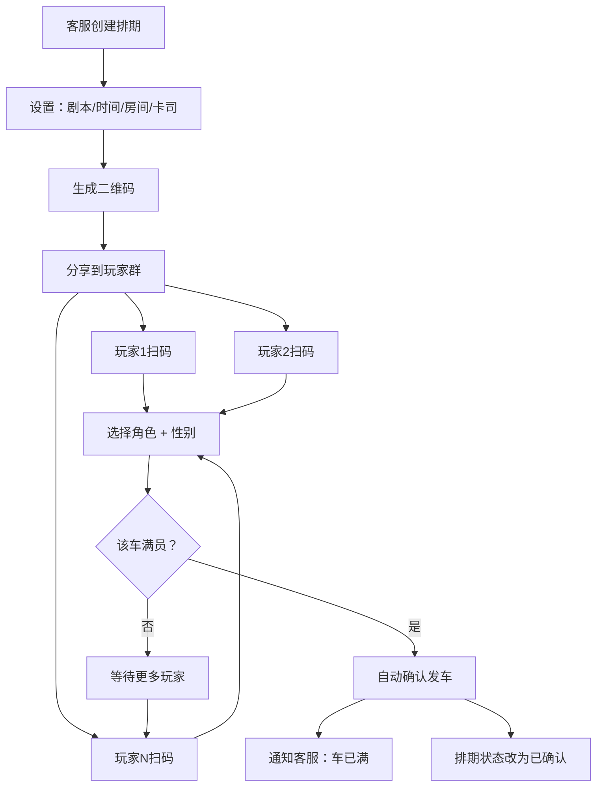
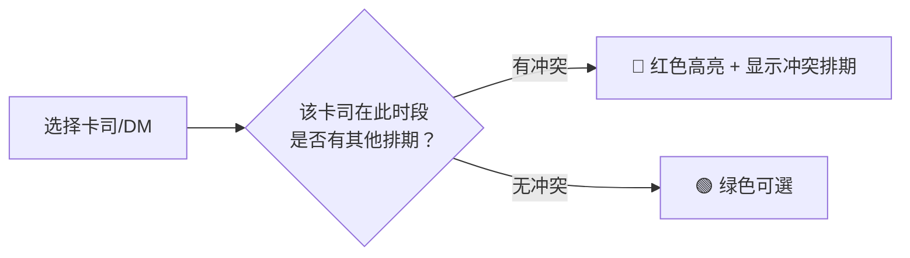

# 抢车模式 + 冲突高亮 — 方案设计

## 一、什么是抢车模式

### 现状问题
现在客服要等到凑满一车人才能创建排期，或者创建了排期但不知道谁上车了谁没上。

### 抢车模式的核心逻辑

```
玩家扫码 → 选角色 → 上车
                 ↓
        该车是否已满？
        ├── 满 → 自动确认发车
        └── 未满 → 显示还差几人，等待更多玩家
```

```
客服视角：
创建一车 → 设置 剧本/时间/房间/卡司
         → 生成二维码
         → 发给玩家群
         → 玩家自己扫码上车
         → 满人自动发车
```

## 二、页面流程



## 三、冲突高亮

### 卡司冲突检测


### 房间冲突检测
```
选择房间 → 检查该房间在同一时段是否有其他排期
         ├── 有 → 红色高亮，显示已被谁占用
         └── 无 → 正常显示
```

## 四、排班表格的新设计

### 现在（简化版表格）

| 日期 | 时间 | 剧本 | 房间 | 人数 | 状态 |
|------|------|------|------|------|------|

### 抢车模式（新版）

| 日期 | 时间 | 剧本 | 房间 | 🚗 上车情况 | 卡司 | 状态 | 操作 |
|------|------|------|------|------------|------|------|------|
| 5/6 | 14-17 | 来电 | 中式房 | 🟢侦探✓ 🟢医生✓ ⚪凶手 ⚪护士 | DM小明 | 🚗 拼车中 | 补人 |
| 5/6 | 19-22 | 来电 | 中式房 | 🟢侦探✓ 🟢医生✓ 🟢凶手✓ 🟢护士✓ | DM小红 | ✅ 已满 | 发车 |
| 5/7 | 13-16 | 年轮 | 欧式房 | ⚪陈烁 ⚪刘伯一 ⚪王小冉 ⚪李可 | DM小华 | 🆕 新车 | 扫码 |

**图例：**
- 🟢 角色名✓ = 已上车
- ⚪ 角色名 = 待上车
- 🚗 拼车中 = 还没满
- ✅ 已满 = 可发车
- 🆕 新车 = 刚创建

## 五、扫码页的抢车体验

```
玩家扫码 → 看到该车的实时状态：
           「来电 | 5/6 14:00-17:00 | 中式房」
           
           已上车：
           🟢 侦探（男）小明
           🟢 医生（女）小红
           
           可选：
           ⚪ 凶手（男）
           ⚪ 护士（女）
           
           → 选角色 → 确认上车
           → 上车后看到：「还差 2 人，等待发车…」
```

## 六、技术改动清单

### 后端 API

| 改动 | 说明 |
|------|------|
| `GET /api/schedules` | 返回每个排期的 `checkins` + `player_roles`（已有）|
| `GET /api/schedules/conflicts` | 检查指定时段内卡司/房间的冲突 |
| `POST /api/schedules/:id/checkin` | 签到后检查是否满员，满员自动更新状态（已有签到）|

### 前端

| 改动 | 说明 |
|------|------|
| `ScheduleCalendar.tsx` | 表格增加卡司列 + 上车状态列 + 冲突高亮 |
| `ScheduleCalendarModal.tsx` | 选卡司/房间时实时显示冲突 |
| `CheckInPage.tsx` | 显示实时上车状态（已有）|

### 冲突高亮实现

选择卡司时，调用 `GET /api/schedules/conflicts?actorId=xxx&date=2026-05-06&startTime=14:00&endTime=17:00`：
- 返回冲突列表（如果有）
- 前端红色高亮显示冲突卡司/房间
- 并显示「该卡司此时段有排期：来电 14:00-17:00」

## 七、实现顺序

```
第一优先：冲突高亮（选卡司/房间时显示冲突）
第二优先：排班表显示上车状态 + 满员状态  
第三优先：满员自动发车
```

---

*方案设计 v0.1 | 2026-05-05*
